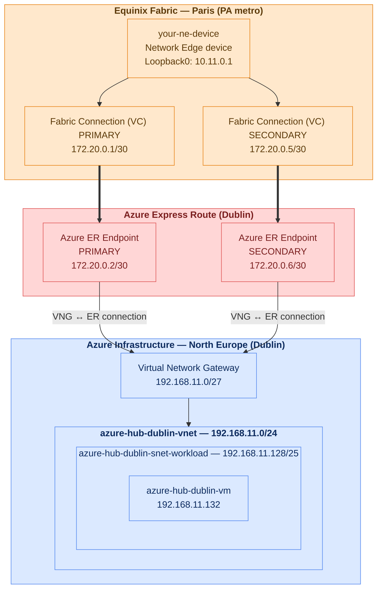

# Azure Hub (Minimal setup) - connected to existing Equinix Network Edge

Minimal reference architecture: an Azure hub VNet connected to an existing
Equinix Network Edge device over a redundant ExpressRoute Fabric connection,
with a VM reachable from on-prem over BGP once the private peering is up.

This project is built in the Dublin region as an example — the same
pattern applies to any Azure region and Equinix metro.

It requires an existing Network Edge device and an existing Azure
ExpressRoute Circuit — its service key (from the Azure Portal) is provided
explicitly via `.env`. See [1. Required information](#1-required-information).

## Summary

- [1. Required information](#1-required-information) — every variable you must fill in with your own values
- [2. Architecture](#2-architecture) — diagram of what's existing vs. created
- [3. Prerequisites](#3-prerequisites) — tools, access, and existing infra you need before running this
- [4. Quick Start](#4-quick-start) — step-by-step apply instructions
- [5. Post-deployment setup](#5-post-deployment-setup) — manual NE BGP config
- [6. End-to-end ping test](#6-end-to-end-ping-test) — optional connectivity proof
- [7. Key design notes](#7-key-design-notes) — non-obvious decisions and constraints
- [8. Teardown](#8-teardown)
- [9. Resource inventory](#9-resource-inventory) — every resource this Terraform touches

## 1. Required information

Most of these go in `terraform.tfvars` (copy it from `terraform.tfvars.example`).
The ones marked `.env` go in `.env` instead (copy it from `.env.example`) —
see [Quick Start](#4-quick-start) for how the two files are used together.
Examples below are taken directly from those two files; replace them with
your own values.

| Variable | File | What it is | Example |
|---|---|---|---|
| `equinix_client_id` | `.env` | Fabric API Client ID | `your-client-id` |
| `equinix_client_secret` | `.env` | Fabric API Client Secret | `your-client-secret` |
| `azure_subscription_id` | `.env` | Azure subscription | `xxxxxxxx-xxxx-xxxx-xxxx-xxxxxxxxxxxx` |
| `azure_er_service_key` | `.env` | Existing ExpressRoute Circuit's service key | `xxxxxxxx-xxxx-xxxx-xxxx-xxxxxxxxxxxx` |
| `admin_ssh_public_key` | `.env` | Your SSH public key | `ssh-rsa AAAAB3Nza...` |
| `bgp_auth_key` | `.env` | Optional BGP MD5 key | `aB3xTq9LmZk2Wp7VcRn4` |
| `equinix_ne_device_uuid` | `terraform.tfvars` | Existing NE device UUID | `xxxxxxxx-xxxx-xxxx-xxxx-xxxxxxxxxxxx` |
| `equinix_sp_azure_er_uuid` | `terraform.tfvars` | Azure ER service profile UUID | `xxxxxxxx-xxxx-xxxx-xxxx-xxxxxxxxxxxx` |
| `equinix_connection_prefix` | `terraform.tfvars` | Fabric connection name prefix | `yourname` |
| `equinix_azure_metro_code` | `terraform.tfvars` | Equinix metro of the ER circuit | `DB` |
| `customer_bgp_asn` | `terraform.tfvars` | Your NE device's BGP ASN | `65001` |
| `ne_azure_bandwidth_mbps` | `terraform.tfvars` | Fabric connection bandwidth (Mbps) | `50` |
| `notification_emails` | `terraform.tfvars` | Fabric notification email(s) | `["your-team@example.com"]` |
| `azure_resource_group_name` | `terraform.tfvars` | Existing Resource Group | `my-resource-group` |
| `azure_er_circuit_name` | `terraform.tfvars` | Existing ExpressRoute Circuit | `my-expressroute-circuit` |
| `azure_vlan_id` | `terraform.tfvars` | VLAN ID for ER private peering | `300` |
| `azure_primary_peer_subnet` | `terraform.tfvars` | Primary BGP session /30 | `172.20.0.0/30` |
| `azure_secondary_peer_subnet` | `terraform.tfvars` | Secondary BGP session /30 | `172.20.0.4/30` |
| `vnet_address_space` | `terraform.tfvars` | Hub VNet address space | `192.168.11.0/24` |
| `gateway_subnet_prefix` | `terraform.tfvars` | GatewaySubnet prefix | `192.168.11.0/27` |
| `workload_subnet_prefix` | `terraform.tfvars` | Workload subnet prefix | `192.168.11.128/25` |
| `admin_source_cidr` | `terraform.tfvars` | Your public IP for SSH/ICMP | `203.0.113.10/32` |
| `project_name` | `terraform.tfvars` | Resource name/tag prefix | `azure-hub-dublin` |
| `owner` | `terraform.tfvars` | Owner tag | `yourname` |

Everything else (`vng_sku`, `vm_size`, `azure_er_fastpath_enabled`,
`azure_er_authorization_key`, `vm_admin_username`, `onprem_test_prefix`,
`po_number`, `azure_region`, `environment`) has a generic default that's
reasonable to leave as-is for a first deployment.

## 2. Architecture



`Orange` = Equinix Fabric · `Blue` = Azure (Microsoft) · `Red` = Azure ExpressRoute

## 3. Prerequisites

### Software

| Tool | Min version | Used for |
|---|---|---|
| Terraform | >= 1.5.0 | Infrastructure-as-code deployment |
| Azure CLI (`az`) | >= 2.x | `az login` — the `azurerm` provider picks up this session automatically |
| `ssh` / an Equinix Portal login | — | Manual BGP config step (see below) — Equinix's managed config-push API does not reach self-managed NE devices |

### Secured design

- **Azure**: you need an identity with the `Contributor` role (or
  equivalent) on the target Resource Group — either your own Azure user
  account (the default, authenticated via `az login`), or a Service
  Principal's Client ID/Secret (an Entra ID App Registration) if you
  switch to non-interactive auth. This Terraform creates a VNet, subnets,
  a Virtual Network Gateway, a VM, NSG, route table, and an ExpressRoute
  private peering, so `Network Contributor` alone is not enough (it also
  creates a VM).
- **Equinix Fabric**: you need an API Client ID/Secret from
  [developer.equinix.com](https://developer.equinix.com) with access to the
  project containing your Network Edge device, scoped to create Fabric
  Connections and (if applicable) configure NE BGP.
- **Equinix Portal login**: you need this (or SSH, if your device is
  self-managed/BYOL) to reach the Network Edge device's console for the
  manual BGP step — see [Manual BGP config](#manual-bgp-config-ne-device).
- **Secrets are crown jewels**: every credential and secret this project
  uses (API keys, subscription ID, ER service key, SSH key, BGP MD5 key)
  lives in `terraform.tfvars` and `.env` — both gitignored, never committed.
  Treat these two files with the same care as production credentials, not
  as regular project config.

### Resilient design

- **Equinix side**: the two Fabric Connections (VC) are deployed as a
  primary/secondary redundancy pair, giving path-level redundancy from the
  Network Edge device to Azure — if one VC fails, BGP fails over to the
  other.
- **Azure side**: the ExpressRoute circuit itself is metro-resilient — the
  primary and secondary peering IPs land on physically diverse Microsoft
  Enterprise Edge routers within the same metro, so no single device
  failure on Microsoft's side breaks connectivity.

## 4. Quick Start

### 1. Get the code

Clone this repository, or copy its files into your own working directory:

```bash
git clone https://github.com/festrade-equinix/eqx-azure-hub-minimal.git
cd eqx-azure-hub-minimal
```

### 2. Credentials

```bash
cp .env.example .env
# Fill in TF_VAR_equinix_client_id/secret, TF_VAR_azure_subscription_id,
# TF_VAR_azure_er_service_key, TF_VAR_admin_ssh_public_key, and
# optionally TF_VAR_bgp_auth_key.

source .env
az login      # azurerm provider picks up the CLI session automatically
```

### 3. Configure variables

```bash
cp terraform.tfvars.example terraform.tfvars
# Review admin_source_cidr — restrict SSH/ICMP to your own public IP.
```

### 4. Init, plan, apply

```bash
terraform init
terraform validate
terraform plan -out=tfplan
terraform apply tfplan
```

### 4 (alternative) — Step-by-step with `-target`

```bash
source .env
terraform init
terraform validate

# Step 1 — Equinix: primary + secondary Fabric VC (NE → Azure ER, redundancy group)
terraform apply -target=equinix_fabric_connection.ne_to_azure_primary
terraform apply -target=equinix_fabric_connection.ne_to_azure_secondary

# Step 2 — Azure: ER private peering (needs connections PROVISIONED first)
terraform apply -target=azurerm_express_route_circuit_peering.private

# Step 3 — Azure: VNet + subnets + GatewaySubnet
terraform apply -target=azurerm_subnet.gateway -target=azurerm_subnet.workload

# Step 4 — Azure: Virtual Network Gateway (30-45 minutes)
terraform apply -target=azurerm_virtual_network_gateway.hub

# Step 5 — Azure: VNet Gateway ↔ ER connection
terraform apply -target=azurerm_virtual_network_gateway_connection.er

# Step 6 — Azure: VM, NSG, route table + subnet association
terraform apply

# Final check — confirm no remaining drift
terraform plan
```

Then configure NE BGP manually — see
[Manual BGP config](#manual-bgp-config-ne-device).

### 5. Post-deployment checks

```bash
terraform output fabric_conn_ne_to_azure_primary_status
terraform output fabric_conn_ne_to_azure_secondary_status
terraform output bgp_summary   # reference values for the manual BGP config below

az network express-route peering show \
  --circuit-name my-expressroute-circuit \
  --resource-group my-resource-group \
  --name AzurePrivatePeering

az network vpn-connection show \
  --resource-group my-resource-group \
  --name azure-hub-dublin-vng-conn-er

# SSH to the VM using the fred-ssh-key private key
ssh azureadmin@$(terraform output -raw vm_public_ip)
```

## 5. Post-deployment setup

### Manual BGP config (NE device)

This section covers BGP peering configuration on the Network Edge device
side — outside Terraform, since NE devices are typically self-managed.
Below is a Cisco C8000v example (your-ne-device); adapt the syntax if your
device runs a different platform.

Each Fabric connection binds to its own dedicated interface (not a VLAN
sub-interface); confirm via `terraform state show
data.equinix_network_device.this` (`interface[].assigned_type`) before
applying, since interface numbers can shift if connections are recreated.

At time of writing: primary → `GigabitEthernet9`, secondary →
`GigabitEthernet5`.

```
interface GigabitEthernet9
 description Equinix Fabric VC to Azure ER Dublin - PRIMARY (yourname-azure-pri)
 ip address 172.20.0.1 255.255.255.252
 no shutdown
!
interface GigabitEthernet5
 description Equinix Fabric VC to Azure ER Dublin - SECONDARY (yourname-azure-sec)
 ip address 172.20.0.5 255.255.255.252
 no shutdown
!
router bgp 65001
 neighbor 172.20.0.2 remote-as 12076
 neighbor 172.20.0.2 password <TF_VAR_bgp_auth_key from .env>
 neighbor 172.20.0.6 remote-as 12076
 neighbor 172.20.0.6 password <TF_VAR_bgp_auth_key from .env>
 !
 address-family ipv4
  neighbor 172.20.0.2 activate
  neighbor 172.20.0.2 soft-reconfiguration inbound
  neighbor 172.20.0.6 activate
  neighbor 172.20.0.6 soft-reconfiguration inbound
 exit-address-family
```

The MD5 key (`TF_VAR_bgp_auth_key` in `.env`) was already applied as `shared_key` on the Azure peering during `terraform apply` — both neighbor passwords above must match it exactly (`neighbor <ip> password <string>`, no `0`/`7` prefix needed when typing the plaintext secret fresh) or the sessions will fail to authenticate.

Apply via the Equinix Portal's device console (Network Edge → your-ne-device →
Console), which bypasses the management ACL — direct SSH to
`ssh_ip_address`/`ssh_ip_fqdn` (see `terraform state show
data.equinix_network_device.this`) timed out from this environment, most
likely blocked by the device's mgmt ACL template
(`mgmt_acl_template_uuid`) not allow-listing the source IP.

Once applied, verify via the Azure Portal → `my-expressroute-circuit` →
**Circuit Status** tab: ARP/BGP Availability should flip from "Not
Available" to available for both Primary and Secondary IPv4.

## 6. End-to-end ping test

`10.11.0.1` doesn't exist on your-ne-device yet — it's a loopback added
purely to prove the BGP path end-to-end. It must be advertised into BGP or
Azure will never learn a route to it; the workload subnet's route table
already has `bgp_route_propagation_enabled = true` (`azurerm_route_table.
workload`), so once advertised, Azure picks up the route automatically —
no manual Azure route needed. The reverse direction (VM → router) needs no
extra config on the Cisco side, but Azure must allow inbound ICMP from
`10.11.0.1` — that's `azurerm_network_security_rule.allow_icmp_onprem`
(`var.onprem_test_prefix`, applied).

On your-ne-device, in addition to the BGP config above:

```
interface Loopback0
 description BGP connectivity test
 ip address 10.11.0.1 255.255.255.255
!
router bgp 65001
 address-family ipv4
  network 10.11.0.1 mask 255.255.255.255
 exit-address-family
```

Then test both directions:

```bash
# From the VM (SSH in first)
ssh azureadmin@$(terraform output -raw vm_public_ip)
ping -c 4 10.11.0.1

# From your-ne-device (via Equinix Portal console)
ping 192.168.11.132 source Loopback0
```

If the VM → router direction fails but router → VM works (or vice versa),
check `terraform output equinix_ne_bgp_to_azure_primary_state` /
`_secondary_state` and the NSG rule priorities (`allow-icmp-onprem` is 120,
after `allow-ssh`/`allow-icmp` at 100/110 — no conflict, but a stricter
custom rule added later at a lower priority number would shadow it).

## 7. Key design notes

- **Redundancy is mandatory** — the Azure ExpressRoute service profile sets
  `connection_redundancy_required = true`; there is no non-redundant path.
- **Cross-metro connection** — your-ne-device sits in Paris; the Fabric
  connections to the Dublin-peered Azure circuit traverse the Equinix
  backbone (`is_remote = true` on both connections).
- **VLAN** — `azure_vlan_id` (300) must be unique on the your-ne-device port
  and must match between the Fabric connection negotiation and the Azure
  private peering `vlan_id`.
- **Azure auth** — the `azurerm` provider uses `az login` by default.
  Uncomment `tenant_id`, `client_id`, `client_secret` in the provider block
  to switch to service principal auth.
- **GatewaySubnet** — name is hardcoded; Azure requires this exact name for
  any subnet hosting a Virtual Network Gateway.
- **Route table BGP propagation** — `bgp_route_propagation_enabled = true`
  on the workload subnet's route table, so on-prem/Equinix-advertised routes
  reach the VM via the VNet Gateway.
- **SSH/ICMP source** — `admin_source_cidr` scopes the NSG rules; defaults
  to the deploying operator's detected public IP. Widen only if needed.
- **NE BGP is deliberately not a Terraform resource** — Equinix's managed
  config-push API only reaches Equinix-managed devices, and self-managed/BYOL
  is the norm for real NE devices. Configured manually — see
  [Manual BGP config](#manual-bgp-config-ne-device).

## 8. Teardown

```bash
# ⚠️  This immediately disrupts hybrid connectivity to Azure and deletes the VM.
terraform destroy
```

## 9. Resource inventory

| # | Resource | Provider | Action |
|---|---|---|---|
| | ExpressRoute Circuit (my-expressroute-circuit) | Azure | `data` — by name + RG |
| | Resource Group | Azure | `data` — my-resource-group |
| | Network Edge device (your-ne-device) | Equinix | `data` — by UUID |
| | Azure ER service profile | Equinix | `data` — by UUID |
| 1 | **Fabric Connection NE → Azure ER, PRIMARY** | **Equinix** | **resource — EVPL_VC, VD a-side, redundancy priority PRIMARY** |
| 2 | **Fabric Connection NE → Azure ER, SECONDARY** | **Equinix** | **resource — EVPL_VC, joins PRIMARY's redundancy group** |
| 3 | **ExpressRoute Private Peering** | **Azure** | **resource — primary + secondary /30 subnets** |
| 4 | **Hub VNet + GatewaySubnet + workload subnet** | **Azure** | **resource** |
| 5 | **Virtual Network Gateway** | **Azure** | **resource — type ExpressRoute, SKU Standard** |
| 6 | **VNet Gateway ↔ ER Circuit connection** | **Azure** | **resource** |
| 7 | **NSG (allow SSH + ICMP + on-prem ping-test ICMP)** | **Azure** | **resource — 3 rules, associated to workload subnet** |
| 8 | **Route table (BGP propagation enabled)** | **Azure** | **resource — associated to workload subnet** |
| 9 | **SSH public key (fred-ssh-key)** | **Azure** | **resource — registered for VM admin access, reusable across VMs** |
| 10 | **Linux VM + NIC + public IP** | **Azure** | **resource** |

NE BGP configuration is **not** a Terraform resource — see [Manual BGP config](#manual-bgp-config-ne-device).
