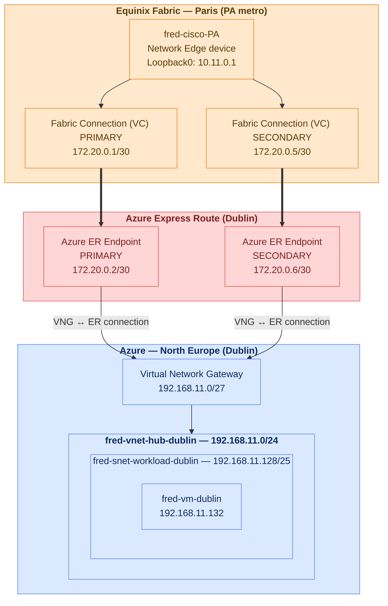

# Azure Hub (Minimal setup) - connected to existing Equinix Network Edge

Minimal reference architecture: an Azure hub VNet connected to an existing
Equinix Network Edge device over a redundant ExpressRoute Fabric connection,
with a VM reachable from on-prem over BGP once the private peering is up.

## Summary

- [1. Required configuration](#1-required-configuration) — every variable you must fill in with your own values
- [2. Architecture](#2-architecture) — diagram of what's existing vs. created
- [3. Prerequisites](#3-prerequisites) — tools, access, and existing infra you need before running this
- [4. Resource inventory](#4-resource-inventory) — every resource this Terraform touches
- [5. Why this device + circuit](#5-why-this-device--circuit) — design rationale for the NE device and ER circuit used
- [6. Deployment](#6-deployment) — step-by-step apply instructions
- [7. Manual BGP config](#7-manual-bgp-config-fred-cisco-pa-is-self-managed) — required manual step for self-managed NE devices
- [8. End-to-end ping test](#8-end-to-end-ping-test) — optional connectivity proof
- [9. Key design notes](#9-key-design-notes) — non-obvious decisions and constraints
- [10. Teardown](#10-teardown)

## 1. Required configuration

Set these in `terraform.tfvars` (copy from `terraform.tfvars.example`) or, for
the ones marked *(.env)*, as `TF_VAR_*` environment variables in `.env`
(copy from `.env.example` — see [Deployment](#6-deployment)). Examples below
are pulled straight from those two example files — swap in your own values.

| Variable | What it is | Example |
|---|---|---|
| `azure_subscription_id` *(.env)* | Azure subscription | `xxxxxxxx-xxxx-xxxx-xxxx-xxxxxxxxxxxx` |
| `azure_resource_group_name` | Existing Resource Group | `my-resource-group` |
| `azure_er_circuit_name` | Existing ExpressRoute Circuit | `my-expressroute-circuit` |
| `equinix_client_id` *(.env)* | Fabric API Client ID | `your-client-id` |
| `equinix_client_secret` *(.env)* | Fabric API Client Secret | `your-client-secret` |
| `equinix_ne_device_uuid` | Existing NE device UUID | `xxxxxxxx-xxxx-xxxx-xxxx-xxxxxxxxxxxx` |
| `equinix_sp_azure_er_uuid` | Azure ER service profile UUID | `xxxxxxxx-xxxx-xxxx-xxxx-xxxxxxxxxxxx` |
| `admin_ssh_public_key` *(.env)* | Your SSH public key | `ssh-rsa AAAAB3Nza...` |
| `admin_source_cidr` | Your public IP for SSH/ICMP | `203.0.113.10/32` |
| `notification_emails` | Fabric notification email(s) | `["your-team@example.com"]` |
| `equinix_connection_prefix` | Fabric connection name prefix | `yourname` |
| `customer_bgp_asn` | Your NE device's BGP ASN | `65001` |
| `azure_vlan_id` | VLAN ID for ER private peering | `300` |
| `azure_primary_peer_subnet` | Primary BGP session /30 | `172.20.0.0/30` |
| `azure_secondary_peer_subnet` | Secondary BGP session /30 | `172.20.0.4/30` |
| `vnet_address_space` | Hub VNet address space | `192.168.11.0/24` |
| `gateway_subnet_prefix` | GatewaySubnet prefix | `192.168.11.0/27` |
| `workload_subnet_prefix` | Workload subnet prefix | `192.168.11.128/25` |
| `equinix_azure_metro_code` | Equinix metro of the ER circuit | `DB` |
| `ne_azure_bandwidth_mbps` | Fabric connection bandwidth (Mbps) | `50` |
| `project_name` | Resource name/tag prefix | `fred-azure-hub-dublin` |
| `owner` | Owner tag | `fred` |
| `bgp_auth_key` *(.env)* | Optional BGP MD5 key | `aB3xTq9LmZk2Wp7VcRn4` |

Everything else (`vng_sku`, `vm_size`, `azure_er_fastpath_enabled`,
`azure_er_authorization_key`, `vm_admin_username`, `onprem_test_prefix`,
`po_number`, `azure_region`, `environment`) has a generic default that's
reasonable to leave as-is for a first deployment.

## 2. Architecture



`Orange` = Equinix Fabric · `Blue` = Azure (Microsoft) · `Red` = Azure ExpressRoute

## 3. Prerequisites

### Tools

| Tool | Min version | Used for |
|---|---|---|
| Terraform | >= 1.5.0 | Everything in this repo |
| Azure CLI (`az`) | >= 2.x | `az login` — the `azurerm` provider picks up this session automatically |
| `ssh` / an Equinix Portal login | — | Manual BGP config step (see below) — Equinix's managed config-push API does not reach self-managed NE devices |

### Access you need before you start

- **Azure**: a subscription with `Contributor` (or equivalent) on the target
  Resource Group — this Terraform creates a VNet, subnets, a Virtual Network
  Gateway, a VM, NSG, route table, and an ExpressRoute private peering.
  `Network Contributor` alone is not enough (it also creates a VM).
- **Equinix Fabric**: an API Client ID/Secret from
  [developer.equinix.com](https://developer.equinix.com) with access to the
  project containing your Network Edge device, scoped to create Fabric
  Connections and (if applicable) configure NE BGP.
- **Equinix Portal login**: to reach the Network Edge device's console for
  the manual BGP step, if your device is self-managed/BYOL (see
  [7. Manual BGP config](#7-manual-bgp-config-fred-cisco-pa-is-self-managed)).

### Existing infrastructure this Terraform expects to already exist

This repo does **not** create these — it looks them up as data sources and
connects to them. Have them ready before running `terraform apply`:

| Existing resource | Where to get its identifier |
|---|---|
| Azure Resource Group | Azure Portal, or `az group list -o table` |
| Azure ExpressRoute Circuit (provider = Equinix, already has a service key) | `az network express-route list -o table` |
| Equinix Network Edge device | Equinix Portal → Network Edge → Devices → device UUID |
| Azure ExpressRoute service profile in the Fabric marketplace | Equinix Portal → Fabric marketplace, search "Azure ExpressRoute", or the Fabric API's `search_service_profiles` |

### Planning inputs to gather first

- A short, unique **name/handle prefix** for the two Fabric connections this
  creates (`equinix_connection_prefix`, ≤ 14 chars) — avoids collisions if
  multiple people deploy from this template into the same Equinix account.
- Your **NE device's configured BGP ASN** (`customer_bgp_asn`) — the
  `equinix_network_device` data source does not reliably report this; you
  need to know it independently (check the device's running config or your
  own records).
- A **VLAN ID** (`azure_vlan_id`) not already in use on your NE device's
  port, and two **/30 subnets** (`azure_primary_peer_subnet`,
  `azure_secondary_peer_subnet`) not already used for another BGP session on
  the same device.
- A **VNet address space** (`vnet_address_space` + the two subnet prefixes)
  that doesn't overlap any network you'll eventually peer or route to.
- Your own **SSH public key** (for `TF_VAR_admin_ssh_public_key` in `.env`)
  and **public IP** (for `admin_source_cidr` in `terraform.tfvars`) —
  `curl ifconfig.me` gets the latter.

## 4. Resource inventory

| # | Resource | Provider | Action |
|---|---|---|---|
| | ExpressRoute Circuit (fred-er-dublin) | Azure | `data` — by name + RG |
| | Resource Group | Azure | `data` — frederic.estrade_rg |
| | Network Edge device (fred-cisco-PA) | Equinix | `data` — by UUID |
| | Azure ER service profile | Equinix | `data` — by UUID |
| 1 | **Fabric Connection NE → Azure ER, PRIMARY** | **Equinix** | **resource — EVPL_VC, VD a-side, redundancy priority PRIMARY** |
| 2 | **Fabric Connection NE → Azure ER, SECONDARY** | **Equinix** | **resource — EVPL_VC, joins PRIMARY's redundancy group** |
| 3 | **NE BGP → Azure ER, primary session** | **Equinix** | **resource — equinix_network_bgp** |
| 4 | **NE BGP → Azure ER, secondary session** | **Equinix** | **resource — equinix_network_bgp** |
| 5 | **ExpressRoute Private Peering** | **Azure** | **resource — primary + secondary /30 subnets** |
| 6 | **Hub VNet + GatewaySubnet + workload subnet** | **Azure** | **resource** |
| 7 | **Virtual Network Gateway** | **Azure** | **resource — type ExpressRoute, SKU Standard** |
| 8 | **VNet Gateway ↔ ER Circuit connection** | **Azure** | **resource** |
| 9 | **NSG (allow SSH + ICMP)** | **Azure** | **resource — associated to workload subnet** |
| 10 | **Route table (BGP propagation enabled)** | **Azure** | **resource — associated to workload subnet** |
| 11 | **Linux VM + NIC + public IP** | **Azure** | **resource** |

## 5. Why this device + circuit

- **fred-cisco-PA** (uuid `371987e0-43fe-4328-a251-039bdc598c0a`) is an existing
  Network Edge device in the Paris (PA) metro. Its connections to Azure in
  Dublin are **remote / cross-metro** — supported because the Azure
  ExpressRoute service profile has `allowRemoteConnections = true`.
- **fred-er-dublin** is a pre-existing Azure ExpressRoute Circuit
  (`frederic.estrade_rg`, `northeurope`, provider Equinix, peering location
  "Dublin Metro"). Its `service_key` is read automatically via the
  `azurerm_express_route_circuit` data source and used as the Equinix Fabric
  `authentication_key`.
- The Azure ExpressRoute service profile has
  `connection_redundancy_required = true`, so **both a primary and a
  secondary Fabric connection are mandatory** — the secondary joins the
  redundancy group Equinix assigns to the primary
  (`one(equinix_fabric_connection.ne_to_azure_primary.redundancy).group`).

## 6. Deployment

> **`terraform.tfstate` contains plaintext secrets** — the Cisco device's
> admin password, the ExpressRoute circuit's service key, and the BGP MD5
> shared key are all stored unencrypted in state (Terraform's `sensitive`
> flag only redacts CLI output, not the state file itself). It's already
> gitignored — never commit it, attach it to a ticket, or share it over
> Slack/email. If this deployment needs to be shared/maintained by more
> than one person, move to a remote backend with encryption at rest and
> access control (e.g. an Azure Storage backend with RBAC, or Terraform
> Cloud) instead of passing the local state file around.

### 0. Credentials

```bash
cp .env.example .env
# Fill in TF_VAR_equinix_client_id/secret, TF_VAR_azure_subscription_id,
# TF_VAR_admin_ssh_public_key, and optionally TF_VAR_bgp_auth_key.

source .env
az login      # azurerm provider picks up the CLI session automatically
```

### 1. Configure variables

```bash
cp terraform.tfvars.example terraform.tfvars
# Review admin_source_cidr — restrict SSH/ICMP to your own public IP.
```

### 2. Init, plan, apply

```bash
terraform init
terraform validate
terraform plan -out=tfplan
terraform apply tfplan
```

### 2 (alternative) — Step-by-step with `-target`

Mirrors the 10 manual steps this repo automates:

```bash
source .env
terraform init
terraform validate

# Step 1 — Equinix: primary + secondary Fabric VC (NE → Azure ER, redundancy group)
terraform apply -target=equinix_fabric_connection.ne_to_azure_primary
terraform apply -target=equinix_fabric_connection.ne_to_azure_secondary

# Step 2 — Azure: ER private peering (needs connections PROVISIONED first)
terraform apply -target=azurerm_express_route_circuit_peering.private

# Step 3 — Equinix: NE BGP routing (primary + secondary)
# NOTE: fred-cisco-PA is a self-managed/BYOL device (confirmed via
# equinix_network_device.self_managed = true). The Equinix-managed config-push
# API that equinix_network_bgp relies on only works for Equinix-managed
# devices — for self-managed ones it 500s ("failed to fetch BGP configuration
# for connection ..."). These two applies WILL fail; skip them and configure
# BGP manually instead (see "Manual BGP config" below).
terraform apply -target=equinix_network_bgp.to_azure_primary
terraform apply -target=equinix_network_bgp.to_azure_secondary

# Step 4 — Azure: VNet + subnets + GatewaySubnet
terraform apply -target=azurerm_subnet.gateway -target=azurerm_subnet.workload

# Step 5 — Azure: Virtual Network Gateway (30-45 minutes)
terraform apply -target=azurerm_virtual_network_gateway.hub

# Step 6 — Azure: VNet Gateway ↔ ER connection
terraform apply -target=azurerm_virtual_network_gateway_connection.er

# Step 7 — Azure: VM, NSG, route table + subnet association
terraform apply

# Final check — confirm no remaining drift
terraform plan
```

### 3. Post-deployment checks

```bash
terraform output fabric_conn_ne_to_azure_primary_status
terraform output fabric_conn_ne_to_azure_secondary_status
terraform output equinix_ne_bgp_to_azure_primary_state
terraform output equinix_ne_bgp_to_azure_secondary_state
terraform output bgp_summary

az network express-route peering show \
  --circuit-name fred-er-dublin \
  --resource-group frederic.estrade_rg \
  --name AzurePrivatePeering

az network vpn-connection show \
  --resource-group frederic.estrade_rg \
  --name fred-vng-conn-er-dublin

# SSH to the VM using the fred-ssh-key private key
ssh fredadmin@$(terraform output -raw vm_public_ip)
```

## 7. Manual BGP config (fred-cisco-PA is self-managed)

`equinix_network_bgp` cannot configure this device — Equinix's managed
config-push API is only available for Equinix-managed devices, and
`equinix_network_device.self_managed` reads `true` for fred-cisco-PA. Each
Fabric connection binds to its own dedicated interface (not a VLAN
sub-interface); confirm via `terraform state show
data.equinix_network_device.this` (`interface[].assigned_type`) before
applying, since interface numbers can shift if connections are recreated.

At time of writing: primary → `GigabitEthernet9`, secondary →
`GigabitEthernet5`.

```
interface GigabitEthernet9
 description Equinix Fabric VC to Azure ER Dublin - PRIMARY (fred-ne-pa-azure-pri)
 ip address 172.20.0.1 255.255.255.252
 no shutdown
!
interface GigabitEthernet5
 description Equinix Fabric VC to Azure ER Dublin - SECONDARY (fred-ne-pa-azure-sec)
 ip address 172.20.0.5 255.255.255.252
 no shutdown
!
router bgp 65001
 neighbor 172.20.0.2 remote-as 12076
 neighbor 172.20.0.2 password <TF_VAR_bgp_auth_key from .env>
 neighbor 172.20.0.6 remote-as 12076
 neighbor 172.20.0.6 password <TF_VAR_bgp_auth_key from .env>
 !
 address-family ipv4
  neighbor 172.20.0.2 activate
  neighbor 172.20.0.2 soft-reconfiguration inbound
  neighbor 172.20.0.6 activate
  neighbor 172.20.0.6 soft-reconfiguration inbound
 exit-address-family
```

The MD5 key (`TF_VAR_bgp_auth_key` in `.env`) was already applied as `shared_key` on the Azure peering during `terraform apply` — both neighbor passwords above must match it exactly (`neighbor <ip> password <string>`, no `0`/`7` prefix needed when typing the plaintext secret fresh) or the sessions will fail to authenticate.

Apply via the Equinix Portal's device console (Network Edge → fred-cisco-PA →
Console), which bypasses the management ACL — direct SSH to
`ssh_ip_address`/`ssh_ip_fqdn` (see `terraform state show
data.equinix_network_device.this`) timed out from this environment, most
likely blocked by the device's mgmt ACL template
(`mgmt_acl_template_uuid`) not allow-listing the source IP.

Once applied, verify via the Azure Portal → `fred-er-dublin` →
**Circuit Status** tab: ARP/BGP Availability should flip from "Not
Available" to available for both Primary and Secondary IPv4.

## 8. End-to-end ping test

`10.11.0.1` doesn't exist on fred-cisco-PA yet — it's a loopback added
purely to prove the BGP path end-to-end. It must be advertised into BGP or
Azure will never learn a route to it; the workload subnet's route table
already has `bgp_route_propagation_enabled = true` (`azurerm_route_table.
workload`), so once advertised, Azure picks up the route automatically —
no manual Azure route needed. The reverse direction (VM → router) needs no
extra config on the Cisco side, but Azure must allow inbound ICMP from
`10.11.0.1` — that's `azurerm_network_security_rule.allow_icmp_onprem`
(`var.onprem_test_prefix`, applied).

On fred-cisco-PA, in addition to the BGP config above:

```
interface Loopback0
 description BGP connectivity test
 ip address 10.11.0.1 255.255.255.255
!
router bgp 65001
 address-family ipv4
  network 10.11.0.1 mask 255.255.255.255
 exit-address-family
```

Then test both directions:

```bash
# From the VM (SSH in first)
ssh fredadmin@$(terraform output -raw vm_public_ip)
ping -c 4 10.11.0.1

# From fred-cisco-PA (via Equinix Portal console)
ping 192.168.11.132 source Loopback0
```

If the VM → router direction fails but router → VM works (or vice versa),
check `terraform output equinix_ne_bgp_to_azure_primary_state` /
`_secondary_state` and the NSG rule priorities (`allow-icmp-onprem` is 120,
after `allow-ssh`/`allow-icmp` at 100/110 — no conflict, but a stricter
custom rule added later at a lower priority number would shadow it).

## 9. Key design notes

- **Redundancy is mandatory** — the Azure ExpressRoute service profile sets
  `connection_redundancy_required = true`; there is no non-redundant path.
- **Cross-metro connection** — fred-cisco-PA sits in Paris; the Fabric
  connections to the Dublin-peered Azure circuit traverse the Equinix
  backbone (`is_remote = true` on both connections).
- **VLAN** — `azure_vlan_id` (300) must be unique on the fred-cisco-PA port
  and must match between the Fabric connection negotiation and the Azure
  private peering `vlan_id`.
- **Azure auth** — the `azurerm` provider uses `az login` by default.
  Uncomment `tenant_id`, `client_id`, `client_secret` in the provider block
  to switch to service principal auth.
- **GatewaySubnet** — name is hardcoded; Azure requires this exact name for
  any subnet hosting a Virtual Network Gateway.
- **Route table BGP propagation** — `bgp_route_propagation_enabled = true`
  on the workload subnet's route table, so on-prem/Equinix-advertised routes
  reach the VM via the VNet Gateway.
- **SSH/ICMP source** — `admin_source_cidr` scopes the NSG rules; defaults
  to the deploying operator's detected public IP. Widen only if needed.
- **NE BGP (equinix_network_bgp)** — works natively on the Cisco NE device
  via the Equinix Network Edge API; no SSH/Ansible workaround required.

## 10. Teardown

```bash
# ⚠️  This immediately disrupts hybrid connectivity to Azure and deletes the VM.
terraform destroy
```
